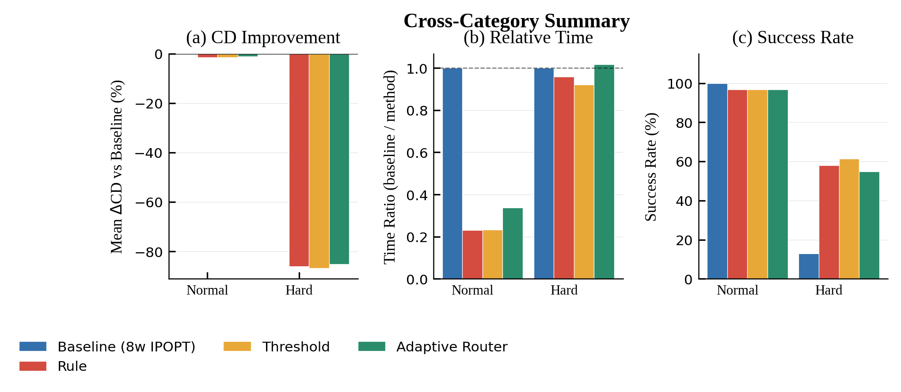
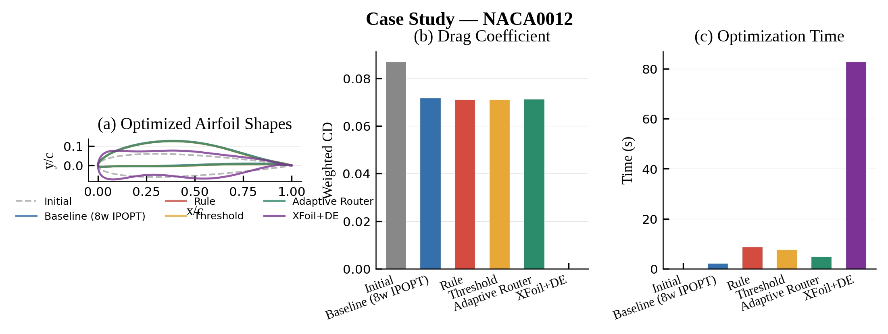
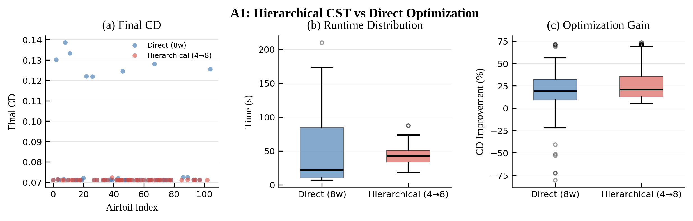

# PiERN-Airfoil

Hierarchical CST airfoil optimization with adaptive fidelity routing.

## Overview

PiERN-Airfoil uses **CST parameterization dimension as the fidelity axis** for multi-fidelity airfoil optimization. Instead of switching between different physics models, it adaptively expands the number of CST weights (4 -> 6 -> 8) based on optimization history.

```
Initial Airfoil (NACA xxxx)
    |
    v
Stage 1: Optimize 4 CST weights/edge (low-dimensional, fast)
    |
    v  OptRouter decides: CONTINUE or EXPAND?
Stage 2: Optimize 6 CST weights/edge (medium fidelity)
    |
    v  OptRouter decides: CONTINUE or EXPAND?
Stage 3: Optimize 8 CST weights/edge (full fidelity)
    |
    v
Optimized Airfoil
```

## Installation

```bash
git clone https://github.com/R-226/piern_airfoil.git
cd piern_airfoil
uv sync
uv pip install -e .
```

Optional dependencies:

```bash
uv sync --extra train    # LLM prompt extraction training (torch)
uv sync --extra ui       # Gradio web UI
```

## Quick Start

### Python API

```python
import aerosandbox as asb
from piern_airfoil import AdaptiveHierarchicalOptimizer
from piern.router import OptRouter
import numpy as np

CL_TARGETS = np.array([0.8, 1.0, 1.2, 1.4, 1.5, 1.6])
CL_WEIGHTS = np.array([5.0, 6.0, 7.0, 8.0, 9.0, 10.0])
RE = 500e3 * (CL_TARGETS / 1.25) ** -0.5

router = OptRouter.from_mlp()
optimizer = AdaptiveHierarchicalOptimizer(
    CL_targets=CL_TARGETS, CL_weights=CL_WEIGHTS,
    Re=RE, mach=0.03, router=router,
)

airfoil = asb.KulfanAirfoil("naca0012")
result = optimizer.optimize(airfoil)
print(f"Final CD: {result.final_cd:.6f}")
```

### Pipeline (Chinese prompt + image)

```python
from piern.pipeline import PiernPipeline

pipeline = PiernPipeline(router_mode="mlp")
result = pipeline.run(
    prompt="设计一个翼型，马赫数0.03，CL目标是0.8到1.6...",
    airfoil_image="path/to/airfoil.png",
)
pipeline.visualize(result)
```

### Web UI

The Gradio web demo accepts a Chinese prompt and an airfoil image (or `.dat` file) and runs the full PiERN pipeline end-to-end. After launching, open `http://127.0.0.1:7860`.

```bash
# launch from project root
uv run python -m piern.view.app
# or, equivalently
cd src/piern/view && uv run python app.py
```

**Step-by-step usage (with the bundled NACA 0012 example):**

1. Paste the prompt below into the **Optimization prompt (Chinese)** textbox.
2. In the **Airfoil image** field, upload `data/benchmark_images/naca0012.png` (or your own airfoil sketch / `.dat` file).
3. Leave **Router mode** at the default `mlp`.
4. Click **Optimize**. Expect ~10s for end-to-end run on NACA 0012; results appear in the **Summary** and **Shape & Performance Comparison** panels.

**Example prompt (copy-paste ready, verified end-to-end on NACA 0012):**

> 在满足Re=500k(CL/1.25)^{-0.5}、Mach=0.03的条件下，我想要优化附加图片当中的翼型。为了对所需的条件下尽可能提高升阻比，我们需要对升力系数CL=[0.8,1.0,1.2,1.4,1.5,1.6]的条件下的阻力按照权重[5,6,7,8,9,10]来进行优化，要求在任意升力系数下，力矩系数不小于-0.133，同时为了保证机翼的物理强度我们要求后缘角度在6.03度以上，前缘角为180度（即前缘光滑），同时我们要求前段位于三分之一处机翼相对厚度不小于0.128,后段相对弦长90%处相对厚度不小于0.014。基于这样的条件对翼型进行优化

**What the prompt is parsed into (18 output fields):**

| Field | Value (verified on NACA 0012) |
|---|---|
| `Mach` | `0.03` |
| `CL` | `[0.8, 1.0, 1.2, 1.4, 1.5, 1.6]` |
| `weights` | `[5, 6, 7, 8, 9, 10]` |
| `CM_lower_bound` | `-0.133` |
| `Trailing_edge_angle_lower_bound` | `6.03` |
| `Leading_edge_angle` | `180.0` |
| `thickness_head_lower_bound` (`t@33%`) | `0.128` |
| `thickness_tail_lower_bound` (`t@90%`) | `0.014` |

Expected end-to-end result on NACA 0012:

| Method | CD | Time | Stages |
|---|---|---|---|
| Initial (extracted) | 0.0754 | - | - |
| Baseline (8w IPOPT) | 0.0722 | ~2.5s | 1 |
| **Adaptive Router** | **0.0711** | ~10s | **2** |

The Chinese number parser is regex-based (with a small Transformer fallback for ambiguous cases), so you can phrase the same prompt in many ways and still get the same 18-field output. **Tip:** the parser matches numbers positionally, so avoid inlining extra formulas or symbols (`e3`, `^`, parenthesized expressions) in the same line as the actual field values — list Mach, CL, and weights on dedicated lines and the parser stays reliable.

| Category | Count | Fields |
|---|---|---|
| Mach | 1 | `Mach = 0.03` |
| CL targets | 6 | `CL = [0.8, 1.0, 1.2, 1.4, 1.5, 1.6]` |
| Weights | 6 | `weights = [5, 6, 7, 8, 9, 10]` |
| Constraints | 5 | `CM ≥ -0.133`, `TE_angle ≥ 6.03°`, `LE_angle = 180°`, `t@33% ≥ 0.128`, `t@90% ≥ 0.014` |

The Chinese number parser is regex-based (with a small Transformer fallback for ambiguous cases), so you can phrase the same prompt in many ways and still get the same 18-field output.

**Note on input format:** the airfoil image is extracted via sub-pixel iso-contour tracking (`skimage.measure.find_contours`) and then Kulfan-fitted by aerosandbox. For highest precision, upload a `.dat` file directly (it bypasses image extraction entirely).

## Architecture

```
src/
├── piern_airfoil/                  # Core optimization engines
│   ├── optimizer.py                # Baseline: single-stage 8-weight IPOPT
│   ├── hierarchical.py             # Core: adaptive 4->8 weight expansion
│   ├── eval.py                     # Shared weighted CD evaluation (NeuralFoil)
│   ├── xfoil_optimizer.py          # Classic baseline: XFoil + Differential Evolution
│   └── _legacy/                    # Ablation baselines (DE, L-BFGS-B, early router)
│
├── piern/                          # Integration layer
│   ├── router/                     # Fidelity routing
│   │   ├── opt_router.py           # OptRouter: rule/threshold/mlp modes
│   │   ├── mlp_router.py           # MLP router training (~1000 params)
│   │   ├── train_threshold.py      # Grid search for optimal threshold
│   │   └── trained/                # Saved model weights
│   ├── prompt2data/                # Chinese NL -> structured parameters
│   │   └── encoder_extractor.py    # Regex + Transformer classifier
│   ├── view/                       # Gradio web UI
│   │   ├── app.py                  # Interactive optimization interface
│   │   └── extract.py              # Airfoil image contour extraction (edge detection)
│   └── pipeline.py                 # End-to-end orchestration
│
tests/
├── benchmark_router.py             # 5 methods x 105 airfoils comparison
├── benchmark_pipeline.py           # Ground truth vs image extraction accuracy
├── benchmark_ablation.py           # 4 ablations + sensitivity analysis
└── run_all_benchmarks.py           # One-click benchmark orchestrator
```

## Optimization Methods

| Method | Description |
|--------|-------------|
| Baseline | Direct 8-weight IPOPT (single-stage) |
| Rule | Hierarchical with fixed threshold (0.01) |
| Threshold | Hierarchical with learned threshold (grid search) |
| **Adaptive Router** | Hierarchical with learned MLP policy (~1000 params) |
| XFoil+DE | Classic: Differential Evolution + XFoil black-box evaluation |

## OptRouter Modes

| Mode | Description | Training |
|------|-------------|----------|
| `rule` | Fixed improvement threshold (0.01) | None |
| `threshold` | Learned threshold via grid search | `train_threshold.py` |
| `mlp` | Learned MLP policy (~1000 params) | `mlp_router.py` |

## Results

### Cross-Category Summary



105 airfoils across Normal/Medium/Hard categories. (a) CD improvement over baseline, (b) relative optimization time, (c) success rate.

### Case Study: NACA 0012



All five methods applied to NACA 0012. NeuralFoil-based methods achieve similar CD (~0.071) in comparable time, while XFoil+DE is 8x slower.

### Ablation: Hierarchical vs Direct



Hierarchical CST (4→8 weights) achieves comparable CD to direct 8-weight optimization with lower variance and tighter runtime distribution.

## Benchmark Suite

Three benchmarks covering optimization quality, extraction accuracy, and design choices:

```bash
uv run python tests/run_all_benchmarks.py
```

### Router Benchmark
Compares 5 optimization methods on 105 airfoils (Normal/Medium/Hard).

Output: `benchmark_stats.csv`, `table_router_full.csv`, `table_router_latex.tex`, `table_significance.csv`, plus 14 figures (per-category, distribution, difficulty-improvement, method comparison).

### Pipeline Benchmark
Compares ground truth vs image-based extraction accuracy.

Output: `pipeline_benchmark.csv`, plus 4 figures with decomposition metrics (extraction time, optimization time, Kulfan fit error).

### Ablation Study
4 experiments + sensitivity analysis validating design choices (hierarchical vs direct, router effect, starting dimension, per-stage contribution).

Output: `ablation.csv`, plus 6 figures.

## Tests

```bash
uv run pytest tests/ -v
uv run pytest tests/test_pipeline.py -v
uv run pytest tests/ -k "test_router"
```

## Development

```bash
uv run black .
uv run ruff check src/
uv run mypy src/
```

## License

MIT
